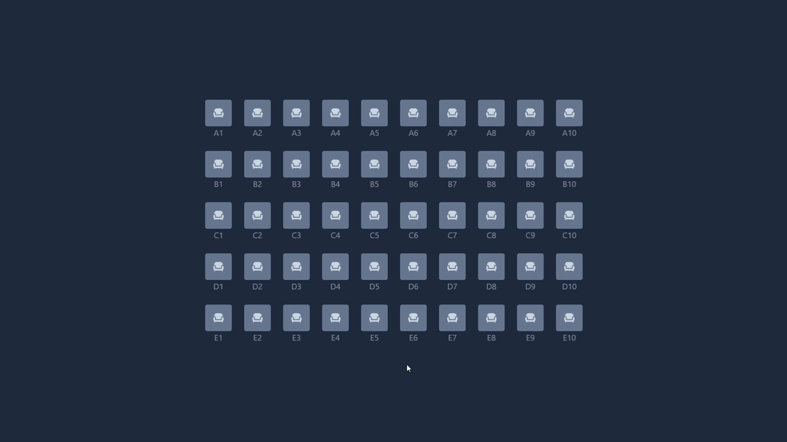
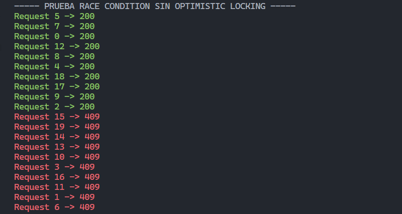
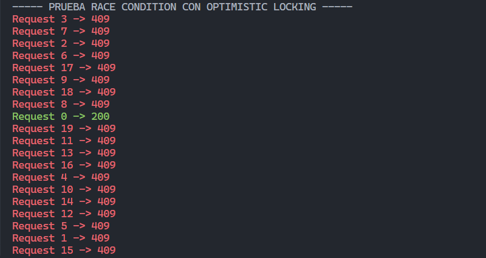

# 🎟️ Sistema de Reserva de Asientos




Aplicación full-stack diseñada para simular un sistema real de reserva de asientos, poniendo el foco en uno de los problemas más críticos en sistemas concurrentes: evitar múltiples reservas sobre un mismo recurso.

El proyecto demuestra cómo gestionar condiciones de carrera (race conditions) en el backend mediante control de concurrencia (optimistic locking), garantizando la consistencia de los datos incluso bajo múltiples peticiones simultáneas.

Además, incorpora comunicación en tiempo real mediante WebSockets, permitiendo que el estado de los asientos se actualice instantáneamente en el frontend sin necesidad de recargar la página.

---

## Características principales

- Prevención de dobles reservas mediante concurrencia
- Actualización en tiempo real con WebSockets
- Simulación de race conditions
- Manejo de errores con códigos HTTP semánticos (404, 409)

---

## Prueba de concurrencia

### Sin Optimistic Locking



Al no tener ningún mecanismo de control de concurrencia, múltiples peticiones pueden acceder simultáneamente al mismo asiento e intentan reservarlo.
Esto provoca una condición de carrera (_race condition_), donde varias operaciones compiten por modificar el mismo recurso, resultando en múltiples respuestas exitosas (`200 OK`) para un único asiento.

Como consecuencia, el sistema permite **dobles (o múltiples) reservas sobre el mismo recurso**, generando inconsistencias en los datos.

### Con Optimistic Locking



Al implementar _optimistic locking_ mediante una columna de versión (`@Version`), cada modificación del asiento incluye una validación automática del estado más reciente en base de datos.

Cuando múltiples peticiones intentan reservar simultáneamente el mismo asiento, solo la primera consigue actualizarlo correctamente. Las siguientes peticiones detectan que el recurso ha sido modificado previamente (la versión ya no coincide) y son rechazadas.

Esto evita la condición de carrera y garantiza la consistencia de los datos, devolviendo una única respuesta exitosa (`200 OK`) y múltiples errores de conflicto (`409 Conflict`).

De esta forma, el sistema asegura que un asiento solo puede ser reservado una vez, incluso bajo alta concurrencia.

---

## Cómo ejecutar el proyecto

### 1. Clonar repositorio

```bash
git clone https://github.com/albxrtx/concurrent-seat-booking.git
```

### 2. Iniciar backend

```bash
cd backend
```

```bash
cd concurrent-seat-booking
```

```bash
cd ./mvnw spring-boot:run
```

### 3. Iniciar frontend

```bash
cd frontend
```

```bash
npm install
```

```bash
npm run dev
```

### 4. Ejecutar script (Para probar concurrencia)

```bash
python scripts/test.py
```
